# DP3 → RoboCasa Porting Notes (v2: FPVNet 채택)

> **이 문서는 전략/아키텍처 노트.** 실제 설치·실행 명령은 **`DP3_RoboCasa_Training_Guide.md`** 참조.

---

## 🎯 목적 (업데이트)

DP3 (3D Diffusion Policy, Ze et al. RSS 2024)를 **RoboCasa atomic 태스크에 파인튜닝**.

**v1 결정 — FPVNet (ALRhub, NeurIPS 2025 PointMapPolicy 그룹) 채택**:
- DP3 포팅 코드를 처음부터 짜는 대신 ALRhub의 검증된 구현 사용 (1.5-2주 → **3-4일** 단축).
- v1 scope: `env_group=drawer` (CloseDrawer + OpenDrawer 2개), seed=0 단일 학습.
- **목표 SR**: ~50% 근방 (PointMapPolicy 페이퍼 보고치 — CloseDrawer 60.0% / OpenDrawer 46.0% / 그룹 평균 53.0%).
- v2 stretch: bbox crop 추가 + 다른 그룹 (sink/buttons) 확장.

---

## 🤝 관련 문서

| 문서 | 내용 |
|---|---|
| **`DP3_RoboCasa_Training_Guide.md`** | 설치/실행 명령, 워크플로우 9단계, argparse 옵션, wandb 설정 |
| **`ROBOCASA_PORT.md`** (이 파일) | 아키텍처 비교, 결정 근거, 검증된 위험, 디버깅 포인터 |

---

## 📁 핵심 파일 인덱스 (FPVNet + custom_robocasa)

### FPVNet (`https://github.com/ALRhub/FPVNet`)

| 파일 | 역할 |
|---|---|
| `agents/dp3_agent.py` | obs_dict → point_cloud + agent_pos(8D) + lang_emb, predict 인터페이스 |
| `agents/models/dp3/dp3_policy.py:71,191,271` | DP3 본체. `lang_emb_net = Linear(512, global_cond_dim)` 추가, **`global_cond += lang_emb_net(lang_emb)`** (concat 아닌 add) |
| `agents/models/dp3/model/vision/pointnet_extractor.py:127,272` | PointNet `[64,128,256]` + maxpool + Linear→`out_channels`. DP3Encoder가 PC+state concat |
| `agents/models/dp3/model/diffusion/conditional_unet1d.py` | UNet1D `down_dims=[512,1024,2048]` (2배 키움), FiLM cond |
| `agents/models/beso/models/networks/clip.py` | **BESO 내장 CLIP** (pip openai/CLIP 아님). `openaipublic.azureedge.net`에서 ViT-B/32 다운로드 |
| `configs/robocasa_dp3_config.yaml` | top-level. **`@hydra.main` 디폴트는 BESO** — `--config-name=robocasa_dp3_config` 반드시 필요 |
| `configs/agents/dp3_agent.yaml` | DP3Agent (AdamW 1e-4, cosine warmup 500) |
| `configs/agents/model/dp3/dp3_policy.yaml` | DDIM 100→10 sample, FiLM, num_points 1024 |
| `configs/trainers/dp3_trainer.yaml:23` | **`if_use_ema: False` 하드코드** (top-level config 값을 silently 덮어씀) |
| `trainers/dp3_trainer.py:49,102` | 100 epoch, save last only, no resume, no mid-eval |
| `environments/dataset/robocasa_dp3_dataset.py:125-130,209` | HDF5 reader. obs 8D = gripper(1)+eef_pos(3)+eef_quat(4). action `actions[:,:7]` |
| `environments/robocasa_env_groups.py:1-20` | **24 task / 8 group** (가이드 정확함) |
| `simulation/robocasa_pc_sim.py:92,189` | eval. predict per-step, `np.concat([action, [0,0,0,0,-1]])` → 12D |
| `scripts/dp3.sh:11` | 8 group × 3 seed = 24 sequential runs |
| `run.py:28,53-59` | `@hydra.main(config_name="robocasa_pc_group_img_config.yaml")` ⚠️ DP3 아님. `trainer.main(agent)` → `env_sim.test_agent(agent)` |

### custom_robocasa (`https://github.com/ALRhub/custom_robocasa`)

| 파일 | 역할 |
|---|---|
| `utils/point_cloud/pc_generator.py:41` | **`get_camera_extrinsic_matrix(sim, cam)` 매 스텝** — PandaOmron 모바일 베이스 호환 ✓ |
| `env_wrappers/point_cloud_wrapper.py:46-52` | 3-cam concat, **bbox crop 없음** ⚠️ |
| `env_wrappers/point_cloud_sampling_wrapper.py` | pytorch3d FPS, `num_points` 가변 |
| `custom_robocasa/robocasa/scripts/dataset_states_to_obs.py` | PC 전처리 스크립트 (vanilla 대비 거의 rewrite). `--pc_size 1024`, `--keep_full_pc`, `--dont_store_image --dont_store_depth` |
| `install.sh` | 5단계: custom_robosuite editable → custom_robocasa editable → requirements → download_kitchen_assets → setup_macros×2 |

---

## 🧭 구조도 (3-way: DP fork ↔ DP3 stock ↔ FPVNet DP3)

```mermaid
flowchart LR
    subgraph DPfork ["🟦 RoboCasa DP fork (2D, 기존)"]
        direction TB
        Text1["📝 Text"]:::lang
        BERT["DistilBERT<br/>→ lang_emb [768]"]:::lang
        RGB1["📷 3× RGB [256×256]"]:::vision2d
        Res["ResNet18ConvFiLM × 3<br/>(lang FiLM 변조)"]:::vision2d
        State1["state [12D]"]:::state
        Concat1["concat:<br/>lang + vision + state"]:::concat
        TF["⚙️ Transformer 12L × 512d<br/>DDPM 100, predict ε"]:::head_t
        A1["🎬 action [16 × 12D]"]:::action

        Text1 --> BERT
        BERT -.FiLM.-> Res
        RGB1 --> Res
        Res --> Concat1
        BERT --> Concat1
        State1 --> Concat1
        Concat1 --> TF
        TF --> A1
    end

    subgraph DP3stock ["🟩 DP3 stock (3D, paper)"]
        direction TB
        NoLang["❌ 언어 없음<br/>(unconditional)"]:::lang
        Depth0["📷 1× Depth [84×84]"]:::vision3d
        PCgen0["unproject + **bbox crop** ✓<br/>FPS 512/1024 → PC xyz"]:::vision3d
        PNet0["PointNetEncoderXYZ<br/>[64,128,256] + MaxPool"]:::vision3d
        State0["agent_pos [D] task-dep<br/>+ state MLP → 64"]:::state
        Concat0["concat: pc_emb + state<br/>= global_cond"]:::concat
        UNet0["⚙️ UNet1D + FiLM<br/>down [512, 1024, 2048]<br/>DDIM 100→10, predict sample<br/>EMA on"]:::head_u
        A0["🎬 action [Ta=8, D]<br/>task-specific dim"]:::action

        Depth0 --> PCgen0
        PCgen0 --> PNet0
        PNet0 --> Concat0
        State0 --> Concat0
        Concat0 -.FiLM.-> UNet0
        UNet0 --> A0
        NoLang -. ❌ .-> Concat0
    end

    subgraph FPVNetDP3 ["🟪 FPVNet DP3 (실제 채택)"]
        direction TB
        Text2["📝 Text<br/>env.get_ep_meta()"]:::lang
        CLIP["BESO CLIP ViT-B/32 (frozen)<br/>→ lang_emb [512]"]:::lang
        Depth["📷 3× Depth+RGB [128×128]<br/>L / R / wrist"]:::vision3d
        PCgen["pc_generator.py<br/>dynamic extrinsics ✓<br/>3-cam concat + FPS 1024<br/>⚠️ NO bbox crop"]:::vision3d
        PNet["PointNetEncoderXYZ<br/>[64,128,256] + MaxPool"]:::vision3d
        State2["agent_pos [8D]<br/>grip+eef_pos+eef_quat"]:::state
        Concat2["concat: pc_emb + state"]:::concat
        LangProj["Linear(512, cond_dim)<br/>**ADD** (concat 아님)"]:::lang
        Cond["global_cond"]:::concat
        UNet["⚙️ UNet1D + FiLM<br/>down [512, 1024, 2048] (= stock)<br/>DDIM 100→10, predict sample<br/>EMA off"]:::head_u
        A2["🎬 action [8 × 7D]<br/>eval: per-step + [0,0,0,0,-1] pad → 12D"]:::action

        Text2 --> CLIP
        Depth --> PCgen
        PCgen --> PNet
        PNet --> Concat2
        State2 --> Concat2
        Concat2 --> Cond
        CLIP --> LangProj
        LangProj -. + .-> Cond
        Cond -.FiLM.-> UNet
        UNet --> A2
    end

    classDef lang fill:#fff3cd,stroke:#f0ad4e,color:#000
    classDef vision2d fill:#cfe2ff,stroke:#0d6efd,color:#000
    classDef vision3d fill:#d4edda,stroke:#198754,color:#000
    classDef state fill:#e2e3e5,stroke:#6c757d,color:#000
    classDef concat fill:#fde2e4,stroke:#dc3545,color:#000
    classDef head_t fill:#f8d7da,stroke:#dc3545,color:#000
    classDef head_u fill:#d1ecf1,stroke:#0dcaf0,color:#000
    classDef action fill:#fff,stroke:#000,color:#000
```

**핵심 차이 (3-way)**:
- **언어**: DP fork = DistilBERT+FiLM into vision / stock DP3 = ❌ / FPVNet = CLIP **add to global_cond** (concat 아님)
- **카메라**: DP fork 3×RGB(256) / stock 1×depth(84) / FPVNet **3×depth(128)** multi-view
- **PC 처리**: stock DP3 = **bbox crop ✓ critical** + FPS 512/1024 / FPVNet = **bbox crop 없음** + FPS 1024 (3-cam concat)
- **UNet**: stock과 FPVNet 동일 `[512, 1024, 2048]` (Python 기본 [256,512,1024]은 두 yaml 모두 override) — **FPVNet이 UNet을 키운 게 아니라 stock과 같은 크기**
- **EMA / horizon**: stock = on, Tp/To = 16/2 / FPVNet = **off** (yaml hardcoded), Tp/To = **8/1**
- **action**: DP fork 16×12D delta / stock Ta=8×task-specific dim / FPVNet 8×7D + eval `[0,0,0,0,-1]` 패딩 → 12D

---

## 🆚 3-way 비교 (정확한 수치)

| 항목 | 🟦 DP fork (2D, 기존) | 🟩 DP3 stock (paper) | 🟪 FPVNet DP3 (채택) |
|---|---|---|---|
| Modality | 3× RGB 256×256 | 1× depth 84×84 → PC 512/1024 | 3× depth+RGB 128×128 → PC 1024 |
| Vision enc. | ResNet18ConvFiLM × 3 | PointNetEnc XYZ MLP [64,128,256] | Same as stock |
| Language | DistilBERT 768D + FiLM | ❌ 없음 | CLIP ViT-B/32 512D + Linear → global_cond **add** |
| State (agent_pos) | base+eef pos/quat + grip = 12D | task-dep (Adroit 24D / MW 9D) | 8D = grip(1)+eef_pos(3)+eef_quat(4) |
| State enc. | concat 직접 | MLP → 64 | Same as stock |
| bbox crop | N/A (2D) | ✓ 필수 (paper T.VII: 78→45 시 SR drop) | ❌ 없음 |
| PC extrinsics | N/A | static `cam_mat0` | **dynamic** `cam_xpos/cam_xmat` ✓ |
| Diffusion head | Transformer 12L × 512d | UNet1D FiLM down [512,1024,2048] | UNet1D FiLM down [512,1024,2048] (**= stock**) |
| Sampler | DDPM 100 (train & infer) | DDIM 100→10 | DDIM 100→10 |
| Prediction | epsilon | sample | sample |
| Tp / To / Ta | 16 / 2 / 8 | 16 / 2 / 8 | **8 / 1 / 8** |
| Batch | 192 | 128 | 256 |
| Optimizer | AdamW 1e-4 | AdamW 1e-4 cosine warmup 500 | Same as stock |
| EMA | on | on | **off** (yaml hardcoded) |
| Action dim | 12D delta | task-dep (paper: abs > delta) | **7D slice + `[0,0,0,0,-1]` pad → 12D** |
| Eval chunking | 16-step chunk replay | Ta=8 chunk replay | **per-step (no chunking)** |
| RoboCasa SR | 15.7% atomic | 미측정 (공개치 없음) | **27.04%** avg / **drawer 53%** |

**의외의 포인트**:
- EMA가 조용히 꺼져 있어도 FPVNet은 27% 달성 (stock recipe 위반)
- 7D만 학습해서 eval에서 `[0,0,0,0,-1]` 상수 패딩으로 12D 액션 복원 (mode=-1 = arm-relative)
- action chunking 없이 매 스텝 예측해도 drawer 53% — open-loop drift 우려 무근거
- bbox crop을 빼고도 DP fork(15.7%)를 능가 — DP3 paper T.VII가 RoboCasa scale엔 덜 critical할 수 있음
- **UNet 폭은 두 yaml 동일 [512,1024,2048]** — 기존 "FPVNet이 2배 키움" 비교는 잘못 (Python default와 비교했던 것)

---

## 🚨 6대 함정 (Opus O1 + O3 검증)

| # | 위험 | 심각도 | 해결책 |
|---|---|---|---|
| 1 | `run.py`의 `@hydra.main` 디폴트 config = **BESO** (DP3 아님) | 🔴 High | **항상** `--config-name=robocasa_dp3_config` + dp3.sh의 모든 override (`agents=dp3_agent trainers=dp3_trainer agent_name=dp3 agents/model=dp3/dp3_policy`) |
| 2 | `if_use_ema` top-level=True지만 `dp3_trainer.yaml:23`이 **False 하드코드** | 🟡 Med | `last_model_ema.pth` 절대 안 생김. EMA 원하면 `dp3_trainer.yaml:23` → `${if_use_ema}`로 패치 |
| 3 | `LinearNormalizer.fit` → **전체 dataset GPU에 올림** (~7-8GB) | 🔴 High | batch 256 + UNet [512,1024,2048] = 24GB GPU OOM 위험. v1은 batch 128 권장 |
| 4 | **bbox crop 없음** (paper Table VII: 78→45 SR drop) | 🔴 High | v2 1순위 개선: `mobilebase0_center` 기준 AABB crop wrapper 추가 |
| 5 | dill 전체 `nn.Module` pickle → 모듈 경로 의존 + **resume 없음** + 마지막 epoch에만 save | 🔴 High | 장기 실행 전 `dp3_trainer.py` 패치: 매 N epoch state_dict 저장 + resume CLI flag |
| 6 | CLIP 첫 실행 시 `openaipublic.azureedge.net` 다운로드 + **매 batch re-encode** | 🟡 Med | 오프라인 환경이면 사전 캐시. 24개 string 캐시 dict로 5-10% 속도 회복 |

추가 인지만:
- `[0,0,0,0,-1]` action 패딩에서 `-1`은 **arm-relative mode** 의미 (composite_controller.py 확인됨). 학습 데모도 arm-mode인지 검증.
- 5번째 action sub-key (ctrl_mode) `-1`이 demo의 mode 분포와 일치하는지 sanity-check.
- `DATASET_BASE_PATH=None` 미설정 시 h5py가 silent fail (의미 없는 에러 메시지).

---

## 📊 디스크 / 시간 현실 체크 (Opus O3)

| 항목 | 가이드 추정 | 검증된 값 |
|---|---|---|
| PC HDF5 disk | ~50GB | **`--dont_store_image --dont_store_depth` 필수**. 없으면 150+ GB |
| 단일 group 학습 (H100, batch 256) | ~3-5h | 학습 3-5h + eval(N task × 50 ep) 1-2h = **4-6h/group** |
| 풀 sweep (8g × 3s) | "비현실적" | **96-168h** 순차 — drawer 단일 그룹 1seed로 축소 필수 |
| Normalizer fit VRAM | 미언급 | **~7-8 GB** at startup (전체 dataset GPU에 올림) |

---

## 🚦 v1 실행 순서 (drawer-only smoke test)

> 정확한 명령은 `DP3_RoboCasa_Training_Guide.md` 참조. 여기는 요약.

1. **환경** (1일): mamba py3.10 + torch 2.4 cu124 + FPVNet 의존성 + `custom_robocasa/install.sh`
2. **데이터 다운로드** (30분~1h): `human_raw` 데이터셋
3. **macros 설정**: `DATASET_BASE_PATH` 절대경로 입력
4. **PC 전처리** (drawer 2 task만, 1-2h): `dataset_states_to_obs --keep_full_pc --dont_store_image --dont_store_depth`
5. **학습 + eval** (4-6h H100): `python run.py --config-name=robocasa_dp3_config --multirun [..overrides..] env_group=drawer seed=0`
6. **결과 확인**: `wandb.log` 또는 stdout `Success rate: X` + hydra working_dir 로그

**Go/no-go 게이트**:
- P3 (학습 시작 후 1h): `bc_loss` 감소 확인. 안 떨어지면 BESO config로 잘못 들어간 것일 수 있음.
- P4 (학습 완료): drawer 그룹 평균 SR ≥ 30% (PMP 페이퍼 53% 대비 보수적 기준)

---

## 📚 추가 참고 (필요 시)

| 자료 | 왜 |
|---|---|
| **PointMapPolicy** (arXiv 2510.20406, NeurIPS 2025) | FPVNet 그룹의 후속작. DP3 baseline 27.04% atomic 평균 보고 (drawer 53%) |
| **FPV-Net** (arXiv 2502.12320) | ALRhub의 비-DP3 3D 정책. DP3 baseline 22.75% 별도 보고 |
| **iDP3** (arXiv 2410.10803) | egocentric PC + pyramid CNN encoder + 4096 pts. v2 인코더 교체 후보 |
| **DP3 paper Table VII** | crop 빼면 78→45. **v2에서 bbox crop 추가 시 SR 상승 기대** |
| **DP3 GitHub Issues** | #40 EGL/OpenGL, #2 MuJoCo build, #125 GPU 활용도 — 포팅 함정 사전 점검 |
